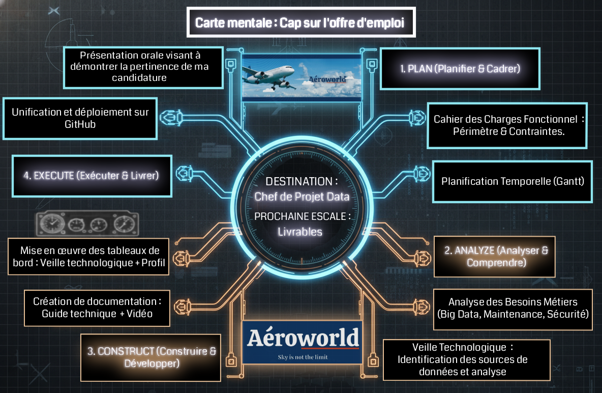

# 🛫 Projet 13 : Créez votre portfolio de professionnel de la data

> **Création d'un portfolio en ligne et élaboration d'une candidature stratégique pour Aéroworld.**

Ce projet final consiste à concevoir un portfolio personnalisé en ligne pour travailler son employabilité et se positionner comme consultant data.
La mission s'inscrit dans un scénario de candidature pour un client fictif exigeant, l'entreprise Aéroworld.

### 📄 Contexte du projet

Pour se démarquer en tant que Data Analyst, la mission exige de concevoir un portfolio à travers une série de livrables précis.

### 🎯 Objectifs de la mission
1. **Cadrage et Planification :** Organiser les idées via une carte mentale, analyser le besoin client, rédiger un cahier des charges fonctionnel et établir un diagramme de Gantt.
2. **Maquettage :** Réaliser des mock-ups pour concevoir visuellement les tableaux de bord et le portfolio.
3. **Développement BI :** Créer deux tableaux de bord métiers (un pour la veille technologique, un autre pour la présentation du profil).
4. **Documentation et Formation :** Produire une vidéo pédagogique pour accompagner la prise en main des outils et rédiger une documentation technique claire.
5. **Déploiement :** Unifier tous ces éléments au sein d'un portfolio en ligne accessible sur GitHub.

---

## 🛠 Compétences Techniques (Hard Skills)
* **Gestion de projet :** Planification, ordonnancement des tâches et suivi des jalons via un **Diagramme de Gantt** et une **Carte mentale**.
* **Business Intelligence (Power BI / Tableau) :** Création de tableaux de bord interactifs (veille technologique et présentation de profil).
* **Documentation et cadrage :** Rédaction d'un **cahier des charges fonctionnel** et formalisation de la documentation technique (ingestion via API, ETL).
* **Veille métier et technologique :** Collecte, analyse et visualisation des tendances du marché de la data.

## 🧠 Compétences Générales (Soft Skills)
* **Posture de consultant :** Adaptation de la communication, présentation professionnelle et compréhension approfondie des besoins métier d'un client.
* **Pédagogie :** Accompagnement des équipes sur la prise en main des outils via la création d'une vidéo de formation technique.
* **Esprit de synthèse :** Organisation claire des idées et présentation de son parcours professionnel de manière percutante.

---

# Candidature - Aéroworld

---

    

---
 
Bienvenue sur l'espace dédié à ma candidature pour le poste de **Data Analyst - Chef de Projet** proposé par Aéroworld.

---

### 🗺️ Plan pour rejoindre Aéroworld

Cette visualisation a pour but de matérialiser la stratégie de pilotage du projet. Conçue comme un véritable "plan de vol", elle a comme objectif principal de rejoindre l'entreprise Aéroworld.

La prochaine escale au sein du parcours de candidature est la création des livrables spécifiques à cette offre.

Afin de répondre à l'impératif demandé, j'ai choisi de structurer la démarche autour de la méthodologie **P.A.C.E.** (*Plan, Analyze, Construct, Execute*) :

    

* **PLAN (Planifier & Cadrer) :** Définition du périmètre et planification des jalons.
* **ANALYZE (Analyser & Comprendre) :** Étude approfondie des besoins métiers d'Aéroworld et conception de solutions.
* **CONSTRUCT (Construire & Développer) :** Phase de production des tableaux de bord interactifs, création de la documentation et enregistrement d'une vidéo de démonstration pédagogique. 
* **EXECUTE (Exécuter & Livrer) :** Unification des livrables, déploiement sur GitHub puis tests de conformité.

## 📂 Structure des Livrables

### 1. [Cahier des Charges Fonctionnel](./Cahier_des_charges/)
Il définit le périmètre fonctionnel, les choix techniques ainsi que les spécifications techniques détaillées pour garantir un livrable conforme aux attentes.

### 2. [Planification & Suivi](./Diagramme_de_gantt/)
Le pilotage temporel du projet, du cadrage initial à la livraison finale. Cette section justifie l'ordonnancement des tâches et définit les dates d'échéance des jalons.

### 3. [Analyse Stratégique & Métier](./Analyse_des_besoins/)
Une étude approfondie de l'écosystème Aéroworld, identifiant les besoins métiers ainsi que les leviers de performance par la Data.

### 4. [Documentation - Préparation des données](./Documentation–Préparation_des_données.pdf)
Guide technique, conçu pour les utilisateurs sous environnement Windows, détaille la procédure d'ingestion de données via API et les étapes de transformation (ETL) nécessaires à l'élaboration d'un tableau de bord de veille technologique.

### 5. [Vidéo de Présentation](https://youtu.be/MI304FXX4WY)
Guide de formation pédagogique au format vidéo sur l'utilisation de Microsoft PowerBi, détaillant la mise en place du tableau de bord profil candidat.
https://youtu.be/MI304FXX4WY

### 6. [Tableau de bord - Veille Technologique](./Veille_Technologique/)
Tableau de bord offre une veille technologique factuelle en s'appuyant sur l'analyse quantitative des offres d'emploi, un indicateur avancé qui permet de confirmer l'utilisation effective des technologies en production au sein des entreprises.

### 7. [Tableau de bord - Portfolio Candidat](./Portfolio_Candidat/)
Tableau de bord interactif offrant une exploration dynamique de mon expertise technique, permetant de visualiser ma maîtrise des outils Data et Business Intelligence en parcourant les projets réalisés.

---

**Jason ZBAKH** - Candidat Chef de Projet Data

> *Note : Ce projet a été réalisé dans le cadre de la formation Data Analyst d'OpenClassrooms.*