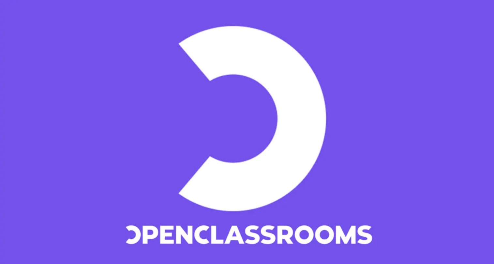

    

# 📂 Parcours Data Analyst - Projets Réalisés

Ce répertoire regroupe les **13 projets pratiques** réalisés pour l'obtention du diplôme de niveau 6 **Data Analyst** dispensé par *[OpenClassrooms](https://openclassrooms.com/)*.

> *OpenClassrooms, désormais université américaine, propose des diplômes d'associé, de licence et de master.*

Chaque projet simule une situation réelle en entreprise, couvrant le cycle complet de la donnée : de l'architecture SQL à la modélisation prédictive en Machine Learning. 📄 [Programme de formation](./1040-data-analyst-fr.pdf)

---

## 🛠 Matrice de Compétences Techniques

Vue d'ensemble des technologies mobilisées sur l'ensemble des projets du parcours.

| Outil / Techno | P13 | P12 | P11 | P10 | P9 | P8 | P7 | P6 | P5 | P4 | P3 | P2 | P1 |
| :--- | :---: | :---: | :---: | :---: | :---: | :---: | :---: | :---: | :---: | :---: | :---: | :---: | :---: |
| **Python** | | ✅ | ✅ | | ✅ | | | ✅ | | ✅ | | | |
| **Machine Learning**| | ✅ | ✅ | | | | | | | | | | |
| **Statistiques** | | | ✅ | | ✅ | | | ✅ | | | | | |
| **Power BI** | ✅ | | | ✅ | | | ✅ | | | | | | |
| **SQL** | | | | | | | | | ✅ | | ✅ | | |
| **KNIME** | | | | | | ✅ | | | | | | | |
| **Excel** | | | | | | | | | | | | ✅ | |
| **Notion** | | | | | | | | | | | | | ✅ |
| **GitHub** | ✅ | | | | | | | | | | | | |

---

## 🚀 Portfolio & Projets

### 🔹 [Projet 13 : Portfolio professionnel et candidature Aéroworld](./Projet_13_Creez_votre_portfolio_de_professionnel_de_la_data/)
* **Compétences :** **Power BI**, **Gestion de projet**, **Cahier des charges**, **GitHub**
* **Mission :** Conception d'un portfolio en ligne et candidature stratégique. Tableaux de bord de veille technologique et profil interactif, documentation technique et déploiement.

### 🔹 [Projet 12 : Détection de faux billets](./Projet_12_Detectez_des_faux_billets_avec_Python/)
* **Compétences :** **Régression Logistique**, **K-Means**, **ACP**, **Scikit-learn**
* **Mission :** Développement d'un algorithme de classification pour l'ONCFM. Comparaison de modèles supervisés et non-supervisés sur les caractéristiques géométriques des billets.

### 🔹 [Projet 11 : Étude de marché internationale](./Projet_11_Produisez_une_etude_de_marche_avec_Python/)
* **Compétences :** **Clustering (K-Means/CAH)**, **PCA**, **Dendrogramme**, **Analyse PESTEL**
* **Mission :** Identification de marchés d'export pour "La Poule qui Chante" via analyse multivariée. Segmentation des pays et validation stratégique des clusters.

### 🔹 [Projet 10 : Dashboard pour une ONG](./Projet_10_Faites_une_etude_sur_eau_potable/)
* **Compétences :** **Power BI**, **Modélisation**, **Storytelling**, **KPIs**
* **Mission :** Création d'un tableau de bord mondial pour l'ONG DWFA. Pilotage de l'accès à l'eau potable via indicateurs Santé/Sécurité/Infrastructures.

### 🔹 [Projet 9 : Analyse des ventes d'une librairie](./Projet_09_Analysez_les_ventes_une_librairie_avec_Python/)
* **Compétences :** **Python**, **Tests statistiques**, **Lorenz/Gini**, **Time Series**
* **Mission :** Audit des ventes de la librairie Lapage. Analyse du comportement client et validation d'hypothèses marketing (Chi-2, ANOVA, Pearson).

### 🔹 [Projet 8 : Analyse d'indicateurs RH & RGPD](./Projet_08_Analysez_indicateurs_egalite_femmes_hommes_RGPD/)
* **Compétences :** **KNIME**, **ETL**, **RGPD**, **Anonymisation**
* **Mission :** Construction d'un workflow automatisé pour le calcul de l'Index Égalité Femmes-Hommes. Traitement de données RH sensibles et conformité réglementaire.

### 🔹 [Projet 7 : Pilotage de projet](./Projet_07_Creez_un_tableau_de_bord_dynamique_avec_Power_BI/)
* **Compétences :** **Power BI**, **DAX**, **RLS**, **Power Query**
* **Mission :** Développement d'un tableaux de bord multi-niveaux pour le pilotage de projets.

### 🔹 [Projet 6 : Optimisation de stock](./Projet_06_Optimisez_la_gestion_des_donnees_une_boutique_avec_Python/)
* **Compétences :** **Python/Pandas**, **Data Cleaning**, **Merge**, **IQR**
* **Mission :** Rapprochement des données ERP et Web pour Bottleneck. Détection d'outliers et calcul du chiffre d'affaires sur 30 000+ produits.

### 🔹 [Projet 5 : Base de données Immobilière](./Projet_05_Creez_et_utilisez_une_base_de_donnees_immobiliere_avec_SQL/)
* **Compétences :** **SQL**, **Modélisation 3NF**, **SGBD**, **Dictionnaire de données**
* **Mission :** Création d'une base de données immobilière pour Laplace Immo. Structuration des données agences et extraction d'indicateurs de performance.

### 🔹 [Projet 4 : Étude de Santé Publique](./Projet_04_Realisez_une_etude_de_sante_publique_avec_Python/)
* **Compétences :** **Python**, **Pandas**, **FAO**, **Analyse démographique**
* **Mission :** Étude sur la sous-nutrition mondiale. Calcul de disponibilité alimentaire et identification des pays prioritaires pour l'aide internationale.

### 🔹 [Projet 3 : Requêtez une base de données SQL (Assurances)](./Projet_03_Requetez_une_base_de_donnees_avec_SQL/)
* **Compétences :** **SQL**, **Requêtes complexes**, **Jointures**, **Agrégation**
* **Mission :** Analyse du portefeuille clients d'une compagnie d'assurance habitation. Extraction de KPIs sur 30 335 contrats et 38 916 lignes géographiques.

### 🔹 [Projet 2 : Analyse de ventes E-commerce](./Projet_02_Faites_une_analyse_de_ventes_pour_un_e-commerce/)
* **Compétences :** **Excel**, **KPI E-commerce**, **Taux de conversion**, **Pivot stratégique**
* **Mission :** Analyse des ventes d'un e-commerce (pivot High-Tech vers Nourriture). Étude du taux de conversion et recommandations user-centric.

### 🔹 [Projet 1 : Prise en main de la formation](./Projet_01_Prenez_en_main_votre_formation_de_Data_Analyst/)
* **Compétences :** **Notion**, **No-Code**, **Gestion de projet**, **Organisation**
* **Mission :** Développement d'un espace de travail professionnel avec rétroplanning interactif, alertes de suivi automatiques et planification des compétences.